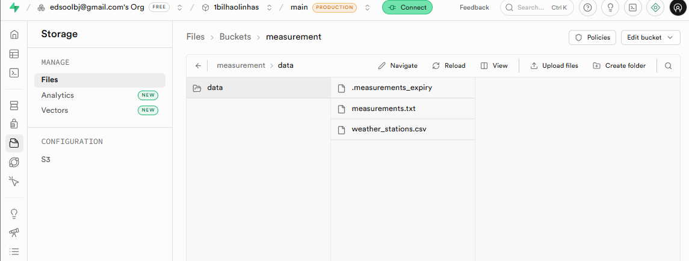

# PR2 — Evolução para Ambiente Empresarial

## Limitação da solução atual (PR #25)

O arquivo `measurements.txt` é gerado e existe **apenas localmente** (na máquina do desenvolvedor).

A deleção automática após 24h só ocorre quando o script `python src/create_measurements_1.py`
é executado novamente — não há um processo rodando em background de forma independente.

Isso é suficiente para uso individual, mas não escala para ambientes colaborativos ou empresariais.

## Evolução sugerida para ambiente empresarial

### Problema
- Arquivo pode chegar a ~14GB (1 bilhão de linhas)
- Ultrapassa o limite do GitHub (100MB por arquivo)
- GitHub Actions não acessa arquivos locais da máquina

### Solução proposta
Mover o arquivo de medições para um **storage compartilhado na nuvem**:

| Componente | Tecnologia sugerida |
|---|---|
| Armazenamento do arquivo | AWS S3 / Google Cloud Storage |
| Deleção automática agendada | AWS Lambda + EventBridge / Apache Airflow |
| Orquestração do pipeline | Apache Airflow |

## Solução implementada — Supabase Storage

Arquivo `supabase_cleanup.py` conecta ao Supabase Storage e:
- Lê o `.measurements_expiry` para verificar o timestamp
- Deleta `measurements.txt` automaticamente após 24h
- Funciona de qualquer máquina, não depende do ambiente local

## Evolução para AWS S3

O *Supabase Storage* é compatível com a *API do AWS S3* —
a migração futura exige apenas trocar as credenciais:

| Configuração | Supabase | AWS S3 |
|---|---|---|
| Endpoint | `https://<project>.supabase.co/storage/v1/s3` | `https://s3.amazonaws.com` |
| Bucket | `measurement` | nome do bucket S3 |
| Credenciais | `SUPABASE_URL` + `SUPABASE_KEY` | `AWS_ACCESS_KEY` + `AWS_SECRET_KEY` |
| Deleção automática | script `supabase_cleanup.py` | S3 Lifecycle Policy nativa |

## Conclusão

A solução com Supabase resolve o problema para times pequenos e médios.
Para escala enterprise, a migração para AWS S3 com Lifecycle Policy
nativa elimina a necessidade do script de limpeza completamente.
